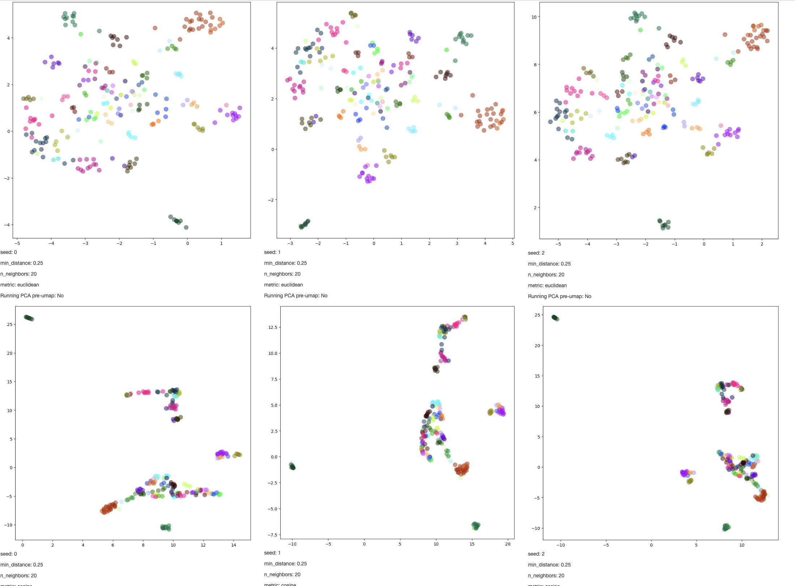

A small tool to run umap with a ton of settings and display them.

Suffice it to say, the official auctorial position is to caution against
overinterpreting umap projections -- they're insufficient as direct evidence
in any sort of argument that actually matters. Still sometimes it's handy to
look at a ton of different hyperparameter settings.

You give it a csv of data and it will run a bunch of UMAPs and show them in a
barebones browser page that looks something this:



That's it! Pre-specified colors/labels maybe forthcoming if they're useful.


## Running

You'll need to install [Conda](https://conda.io) and
[Nextflow](https://www.nextflow.io).

Create a csv with your input data. It must have columns:
- `dim_[N]` [required] numeric input data. It does not matter what value `N` is
       for any of the columns - any column starting with `dim_` is treated as an input
       dimension in the vectors to be umap-projected.

Once that is done, call:

```
./umap_grid --data=[your_csv].csv
```

This will populate a directory called `results` and display the plots therein
at `http://locahost:5000`. Press control-c to exit.

Other params you can pass to `umap_grid`:
- `--num_seeds`: the number of different rand seeds to try.
- `--port`: the port to serve on (instead of `5000`)
- `-resume`: reuse cached UMAPS/plots if you've already run it.
